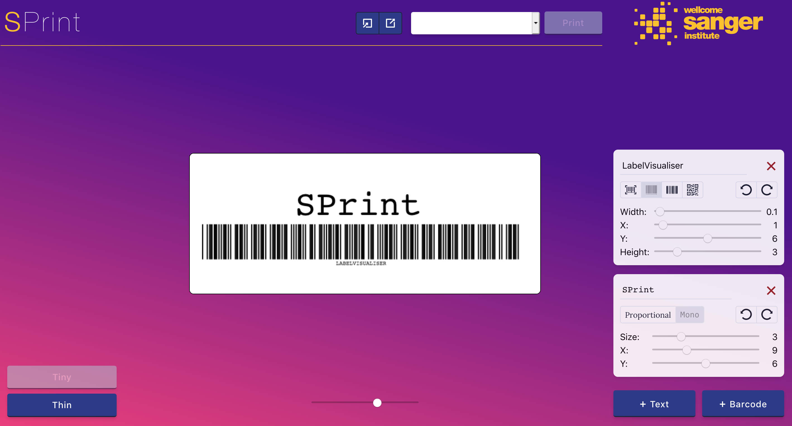

# SPrint Client

> Visual label builder for the SPrint web service



## Dependencies

- NodeJS (>= v12.1)
- Yarn

The project was bootstrapped with [Create React App](https://github.com/facebook/create-react-app).

## Installation

```
yarn install
```

## Getting Started

```
yarn start
```

Runs the app in the development mode. Open [http://localhost:3000](http://localhost:3000) to view it in the browser.

The page will reload if you make edits. You will also see any lint errors in the console.

### TypeScript

The application is written in [TypeScript](https://www.typescriptlang.org/), a typed superset of JavaScript. It will be automatically compiled to JavaScript when the server is running, with any compile errors being shown in the console.

The configuration for TypeScript is in `tsconfig.json`.

### CSS

The CSS is built using the [TailwindCSS](https://tailwindcss.com/) framework, which provides low-level CSS utility classes, removing the amount of CSS you have to write. The configuration for `tailwindcss` is in `tailwind.config.js`.

Any CSS you do need to write, goes in the `src/styles/tailwind.css` file. When the server is running, this file is transformed by `postcss` (a Webpack plugin) to `src/styles/index.css`. The configuration for `postcss` is in `postcss.config.js`.

`index.css` is then imported by the application (see `src/index.tsx`).

### API Integration

Communication with the GraphQL API is done using [Apollo Client](https://www.apollographql.com/docs/react/), a state management library built for React that will request and store data from your API.

You can view examples of the mutations and queries used in `src/{mutations,queries}` directories. 

When editing or creating new mutations or queries, you can use the `yarn codegen` script below to subsequently generate interfaces for them.

## Other Available Scripts

### `yarn codegen`

Use the apollo code generation tool to build interfaces from the SPrint GraphQL API and put them in `src/types/graphql-global-types.ts`. It will also look at any GraphQL `mutations` and `queries` in `src/**/*` and build interfaces for their query variables and responses.

### `yarn build`

Builds the app for production to the `build` folder. It correctly bundles React in production mode and optimizes the build for the best performance.

The build is minified and the filenames include the hashes.

## Barcode Generation

Barcode images are created by two different libraries:

- **1D**: [JsBarcode](https://github.com/lindell/JsBarcode)
- **2D**: [bwip-js](https://github.com/metafloor/bwip-js)

`JsBarcode` unfortunately does not support the creation of `datamatrix` barcodes. 

## Building For Production

Production builds are done by Travis along with production builds of the SPrint API.

Travis will run the `yarn build` script, and then copy the output into the SPrint API's `src/main/resources/static` directory. This is done before `maven package`, so all assets will be bundled up into the one jar.

The client will then be available as the root page. 

## Known Issues/Still TODO

- [ ] Export label templates
- [ ] Import label templates
- [ ] Scaling of 2D barcodes
- [ ] Print requests offer no feedback
- [ ] When selecting an EAN13 barcode type, app doesn't show error if value isn't a valid EAN13
- [ ] No tests 🤦🏻‍♀️
